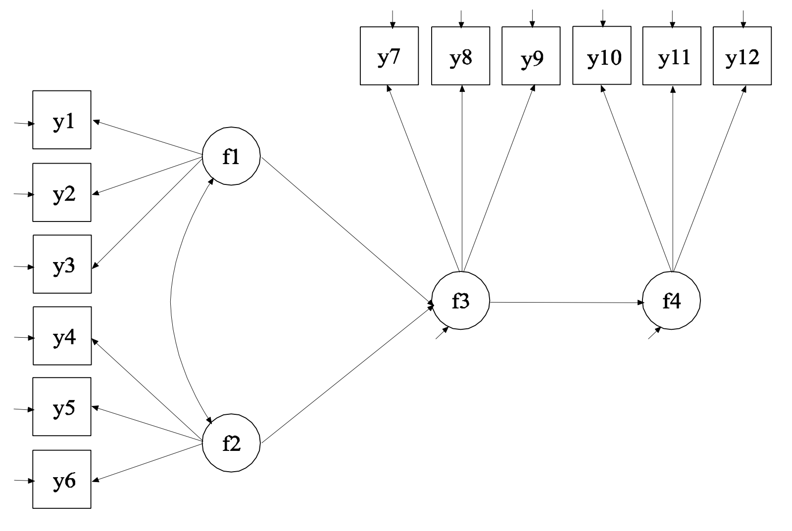
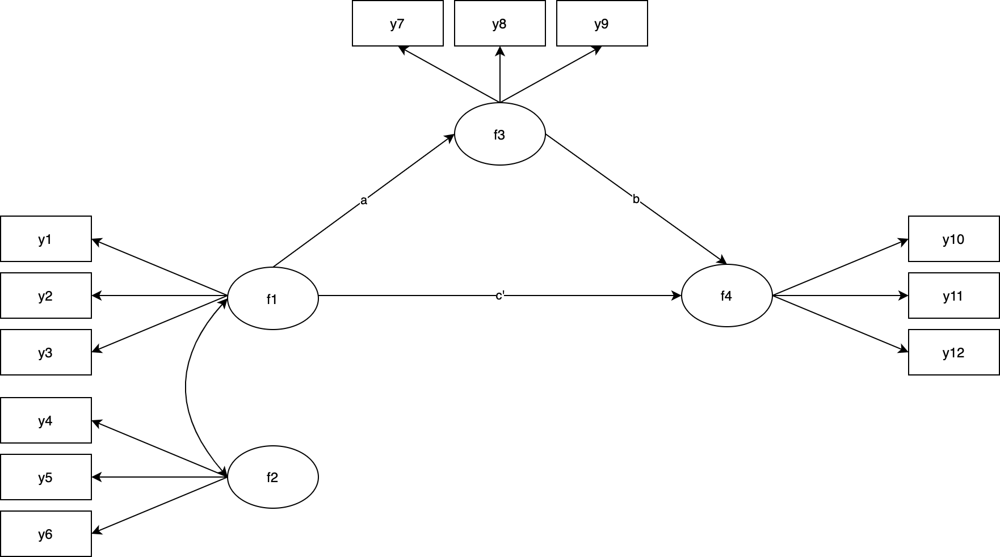

seminR
========================================================
author: Brandon Gavett
date: 2022-04-13
autosize: true

========================================================

We will explore the `lavaan` package and how it can be used to perform structural equation modeling in R.

Code is available at https://github.com/begavett/seminR


Required Packages
========================================================


```r
# if necessary: install.packages("pacman")
library(pacman)
p_load(tidyverse, lavaan, psych, corrgram, semPlot, blavaan)
```

- `tidyverse`: a suite of data tools
- `lavaan`: the focus of today's workshop
- `psych`: statistical tools relevant to psychological research
- `corrgram`: nice correlograms
- `semPlot`: used to draw path diagrams
- `blavaan`: Bayesian lavaan

## Also highly recommended 

(but not used today)

- `semTools`: package that nicely supplements lavaan


Import Data
========================================================


```r
ex5_12 <- read.table("https://www.statmodel.com/usersguide/chap5/ex5.12.dat") %>%
  set_names(paste0("y", 1:12))
```

Describe Data
========================================================


```r
describe(ex5_12)
```

```
    vars   n  mean   sd median trimmed  mad   min  max range  skew kurtosis
y1     1 500  0.01 1.39   0.02    0.01 1.46 -4.08 3.58  7.66 -0.04    -0.27
y2     2 500  0.05 1.43   0.08    0.05 1.37 -5.19 3.94  9.13 -0.06     0.10
y3     3 500  0.00 1.38  -0.09   -0.03 1.48 -3.65 4.19  7.84  0.20    -0.43
y4     4 500  0.10 1.43  -0.01    0.11 1.41 -4.55 4.09  8.64 -0.03     0.04
y5     5 500  0.08 1.27   0.05    0.09 1.27 -3.73 4.86  8.60 -0.07    -0.01
y6     6 500  0.07 1.33   0.01    0.05 1.35 -3.20 4.27  7.48  0.24    -0.17
y7     7 500  0.05 1.52   0.08    0.07 1.57 -4.30 4.34  8.65 -0.09    -0.16
y8     8 500  0.06 1.41   0.13    0.07 1.36 -4.40 3.99  8.39 -0.08     0.02
y9     9 500  0.08 1.40   0.07    0.09 1.45 -4.20 3.43  7.63 -0.08    -0.33
y10   10 500 -0.01 1.44   0.00   -0.01 1.41 -4.17 4.11  8.29  0.02    -0.26
y11   11 500  0.04 1.23   0.04    0.03 1.16 -3.83 3.80  7.63  0.03    -0.15
y12   12 500  0.03 1.21   0.00    0.01 1.29 -3.47 3.84  7.31  0.16    -0.04
      se
y1  0.06
y2  0.06
y3  0.06
y4  0.06
y5  0.06
y6  0.06
y7  0.07
y8  0.06
y9  0.06
y10 0.06
y11 0.05
y12 0.05
```

Visualize Data
========================================================


```r
ex5_12 %>%
  pivot_longer(everything(),
               names_to = "Item",
               values_to = "Score") %>%
  ggplot(aes(x = Item, y = Score)) +
  geom_boxplot()
```


Visualize Data
========================================================


```r
corrgram(ex5_12, upper.panel = "panel.cor")
```


Guide to lavaan Syntax
========================================================

## Correlation/Covariance

```
y ~~ x
```

- Mplus equivalent: 

```
y WITH x;
```

## Regression

```
y ~ x
```

- Mplus equivalent: 

```
y ON x;
```

Guide to lavaan Syntax
========================================================

## Reflective Factors (typical latent variables)

```
f =~ item1 + item2 + item3
```

- Mplus equivalent: 

```
f BY item1 item2 item3;
```

## Formative Factors

```
f <- item1 + item2 + item3
```

- Mplus equivalent: 

```
f BY;
f ON item1 item2 item3;
f@0;
```

Guide to lavaan Syntax
========================================================

## Means/Intercepts

```
f ~ 1
item1 ~ 1
```

- Mplus equivalent: 

```
[f];
[item1];
```

## (Residual) Variances

```
f ~~ f
```

- Mplus equivalent: 

```
f;
```

## Thresholds (for categorical indicators/IRT)

```
item1 | t1 + t2 + t3 # Assume item1 has 4 ordered categorical responses (3 thresholds)
item2 | t1 + t2 # Assume item2 has 3 ordered categorical responses (2 thresholds)
```

- Mplus equivalent: 

```
[item1$1 item1$2 item1$3];
[item2$1 item2$2];
```

Usually you don't need to write syntax for the thresholds (unless doing measurement invariance testing with categorical indicators)


Guide to lavaan Syntax
========================================================

## Fix a parameter to a specific value

### Factor Loadings

```
f =~ 1*item1 + item2 + item3
```

- Mplus equivalent: 

```
f BY item1@1 item2 item3;
```

### Means/Intercepts

```
f ~ 0*1
```

- Mplus equivalent: 

```
[f@0];
```


### (Residual) Variances

```
f ~~ 1*f
```

- Mplus equivalent: 

```
f@1;
```

Guide to lavaan Syntax
========================================================

## Freely estimate a parameter

```
f =~ NA*item1 + item2 + item3
```

- Mplus equivalent: 

```
f BY item1* item2 item3;
```

## Provide starting values before freely estimating a parameter

```
f =~ start(1.25)*item1 + item2 + item3
```

- Mplus equivalent: 

```
f BY item1*1.25 item2 item3;
```

Guide to lavaan Syntax
========================================================

## Assign a label to parameter(s)

```
f =~ lab1*item1 + lab2*item2 + item3
```

- Mplus equivalent: 

``` 
f BY item1 item2 (lab1-lab2)
     item3;
```

## Apply equality constraints to two or more parameters
```
f =~ l1*item1 + l1*item2 + item3
```

- Mplus equivalent: 

``` 
f BY item1 item2 (l1)
     item3;
```


Plan for This Workshop
========================================================

## Mplus User's Guide Example 5.12




Plan for This Workshop
========================================================

https://www.statmodel.com/ugexcerpts.shtml

https://www.statmodel.com/usersguide/chapter5.shtml

## Steps

1. Measurement Models
2. Structural Model
3. Mediation

Measurement Models
========================================================

1. **f1 & f2**
2. f3 & f4


Measurement Model 1: f1 & f2
========================================================


```r
mm1_f1_f2_m <- '
f1 =~ y1 + y2 + y3
f2 =~ y4 + y5 + y6

f1 ~~ f2
'

mm1_f1_f2_f <- cfa(mm1_f1_f2_m, data = ex5_12)
```

Other options (non-exhaustive list) to consider including in the `cfa()` function:

- `ordered` - which variables, if any, are ordinal (limits your choice of estimator)
- `estimator` - probably want "ML" or "MLR" for most continuous data; WLSMV for ordinal
- `missing` - if there is missing data, how to handle it? Prefer "fiml"
- `mimic` - do you want the results to try to match what you'd get from Mplus (`mimic = "mplus"`) or EQS (`mimic = "EQS"`)?  
- `std.lv` - TRUE/FALSE: standardize the latent variable
- `std.ov` - TRUE/FALSE: standardize the observed variables
- `orthogonal` - TRUE/FALSE: make all latent variables uncorrelated with one another

Measurement Model 1: f1 & f2
========================================================


```r
mm1_f1_f2_m <- '
f1 =~ y1 + y2 + y3
f2 =~ y4 + y5 + y6

f1 ~~ f2
'

mm1_f1_f2_f <- cfa(mm1_f1_f2_m, data = ex5_12, estimator = "mlr", missing = "fiml")
summary(mm1_f1_f2_f)
```

```
lavaan 0.6-10 ended normally after 33 iterations

  Estimator                                         ML
  Optimization method                           NLMINB
  Number of model parameters                        19
                                                      
  Number of observations                           500
  Number of missing patterns                         1
                                                      
Model Test User Model:
                                               Standard      Robust
  Test Statistic                                 11.525      11.037
  Degrees of freedom                                  8           8
  P-value (Chi-square)                            0.174       0.200
  Scaling correction factor                                   1.044
       Yuan-Bentler correction (Mplus variant)                     

Parameter Estimates:

  Standard errors                             Sandwich
  Information bread                           Observed
  Observed information based on                Hessian

Latent Variables:
                   Estimate  Std.Err  z-value  P(>|z|)
  f1 =~                                               
    y1                1.000                           
    y2                1.279    0.119   10.774    0.000
    y3                0.985    0.087   11.279    0.000
  f2 =~                                               
    y4                1.000                           
    y5                0.954    0.105    9.059    0.000
    y6                0.889    0.101    8.813    0.000

Covariances:
                   Estimate  Std.Err  z-value  P(>|z|)
  f1 ~~                                               
    f2               -0.030    0.052   -0.586    0.558

Intercepts:
                   Estimate  Std.Err  z-value  P(>|z|)
   .y1                0.011    0.062    0.183    0.855
   .y2                0.047    0.064    0.738    0.460
   .y3                0.005    0.062    0.078    0.938
   .y4                0.104    0.064    1.627    0.104
   .y5                0.078    0.057    1.361    0.173
   .y6                0.074    0.059    1.241    0.215
    f1                0.000                           
    f2                0.000                           

Variances:
                   Estimate  Std.Err  z-value  P(>|z|)
   .y1                1.110    0.095   11.699    0.000
   .y2                0.711    0.122    5.837    0.000
   .y3                1.131    0.097   11.701    0.000
   .y4                1.204    0.117   10.314    0.000
   .y5                0.862    0.102    8.422    0.000
   .y6                1.101    0.095   11.629    0.000
    f1                0.807    0.112    7.182    0.000
    f2                0.835    0.134    6.242    0.000
```

Measurement Model 1: f1 & f2
========================================================


```r
mm1_f1_f2_m <- '
f1 =~ y1 + y2 + y3
f2 =~ y4 + y5 + y6

f1 ~~ f2
'

mm1_f1_f2_f <- cfa(mm1_f1_f2_m, data = ex5_12, estimator = "mlr", missing = "fiml")
summary(mm1_f1_f2_f)
```

Other options (non-exhaustive list) to consider including in the `summary()` function:

- `fit.measures` - TRUE/FALSE: display model fit statistics
- `standardized` - TRUE/FALSE: display standardized parameter estimates
- `ci` - TRUE/FALSE: display confidence intervals
- `modindices` - TRUE/FALSE: display modification indices

Measurement Model 1: f1 & f2
========================================================


```r
mm1_f1_f2_m <- '
f1 =~ y1 + y2 + y3
f2 =~ y4 + y5 + y6

f1 ~~ f2
'

mm1_f1_f2_f <- cfa(mm1_f1_f2_m, data = ex5_12, estimator = "mlr", missing = "fiml")
summary(mm1_f1_f2_f, fit.measures = TRUE, standardized = TRUE)
```

```
lavaan 0.6-10 ended normally after 33 iterations

  Estimator                                         ML
  Optimization method                           NLMINB
  Number of model parameters                        19
                                                      
  Number of observations                           500
  Number of missing patterns                         1
                                                      
Model Test User Model:
                                               Standard      Robust
  Test Statistic                                 11.525      11.037
  Degrees of freedom                                  8           8
  P-value (Chi-square)                            0.174       0.200
  Scaling correction factor                                   1.044
       Yuan-Bentler correction (Mplus variant)                     

Model Test Baseline Model:

  Test statistic                               583.437     568.645
  Degrees of freedom                                15          15
  P-value                                        0.000       0.000
  Scaling correction factor                                  1.026

User Model versus Baseline Model:

  Comparative Fit Index (CFI)                    0.994       0.995
  Tucker-Lewis Index (TLI)                       0.988       0.990
                                                                  
  Robust Comparative Fit Index (CFI)                         0.994
  Robust Tucker-Lewis Index (TLI)                            0.990

Loglikelihood and Information Criteria:

  Loglikelihood user model (H0)              -4913.545   -4913.545
  Scaling correction factor                                  0.984
      for the MLR correction                                      
  Loglikelihood unrestricted model (H1)      -4907.783   -4907.783
  Scaling correction factor                                  1.002
      for the MLR correction                                      
                                                                  
  Akaike (AIC)                                9865.090    9865.090
  Bayesian (BIC)                              9945.168    9945.168
  Sample-size adjusted Bayesian (BIC)         9884.860    9884.860

Root Mean Square Error of Approximation:

  RMSEA                                          0.030       0.028
  90 Percent confidence interval - lower         0.000       0.000
  90 Percent confidence interval - upper         0.065       0.062
  P-value RMSEA <= 0.05                          0.801       0.831
                                                                  
  Robust RMSEA                                               0.028
  90 Percent confidence interval - lower                     0.000
  90 Percent confidence interval - upper                     0.065

Standardized Root Mean Square Residual:

  SRMR                                           0.020       0.020

Parameter Estimates:

  Standard errors                             Sandwich
  Information bread                           Observed
  Observed information based on                Hessian

Latent Variables:
                   Estimate  Std.Err  z-value  P(>|z|)   Std.lv  Std.all
  f1 =~                                                                 
    y1                1.000                               0.898    0.649
    y2                1.279    0.119   10.774    0.000    1.149    0.806
    y3                0.985    0.087   11.279    0.000    0.885    0.640
  f2 =~                                                                 
    y4                1.000                               0.914    0.640
    y5                0.954    0.105    9.059    0.000    0.872    0.685
    y6                0.889    0.101    8.813    0.000    0.813    0.612

Covariances:
                   Estimate  Std.Err  z-value  P(>|z|)   Std.lv  Std.all
  f1 ~~                                                                 
    f2               -0.030    0.052   -0.586    0.558   -0.037   -0.037

Intercepts:
                   Estimate  Std.Err  z-value  P(>|z|)   Std.lv  Std.all
   .y1                0.011    0.062    0.183    0.855    0.011    0.008
   .y2                0.047    0.064    0.738    0.460    0.047    0.033
   .y3                0.005    0.062    0.078    0.938    0.005    0.003
   .y4                0.104    0.064    1.627    0.104    0.104    0.073
   .y5                0.078    0.057    1.361    0.173    0.078    0.061
   .y6                0.074    0.059    1.241    0.215    0.074    0.055
    f1                0.000                               0.000    0.000
    f2                0.000                               0.000    0.000

Variances:
                   Estimate  Std.Err  z-value  P(>|z|)   Std.lv  Std.all
   .y1                1.110    0.095   11.699    0.000    1.110    0.579
   .y2                0.711    0.122    5.837    0.000    0.711    0.350
   .y3                1.131    0.097   11.701    0.000    1.131    0.591
   .y4                1.204    0.117   10.314    0.000    1.204    0.590
   .y5                0.862    0.102    8.422    0.000    0.862    0.531
   .y6                1.101    0.095   11.629    0.000    1.101    0.625
    f1                0.807    0.112    7.182    0.000    1.000    1.000
    f2                0.835    0.134    6.242    0.000    1.000    1.000
```

Measurement Model 1: f1 & f2
========================================================

## Fit Statistics


```r
fitMeasures(mm1_f1_f2_f, c("chisq", "df", "pvalue", "cfi", "tli", 
                           "rmsea", "rmsea.ci.lower", "rmsea.ci.upper", 
                           "srmr"),
            output = "matrix")
```

```
                     
chisq          11.525
df              8.000
pvalue          0.174
cfi             0.994
tli             0.988
rmsea           0.030
rmsea.ci.lower  0.000
rmsea.ci.upper  0.065
srmr            0.020
```


Measurement Model 1: f1 & f2
========================================================

## Parameter Estimates


```r
parameterEstimates(mm1_f1_f2_f, standardized = TRUE)
```

```
   lhs op rhs    est    se      z pvalue ci.lower ci.upper std.lv std.all
1   f1 =~  y1  1.000 0.000     NA     NA    1.000    1.000  0.898   0.649
2   f1 =~  y2  1.279 0.119 10.774  0.000    1.046    1.511  1.149   0.806
3   f1 =~  y3  0.985 0.087 11.279  0.000    0.814    1.156  0.885   0.640
4   f2 =~  y4  1.000 0.000     NA     NA    1.000    1.000  0.914   0.640
5   f2 =~  y5  0.954 0.105  9.059  0.000    0.748    1.161  0.872   0.685
6   f2 =~  y6  0.889 0.101  8.813  0.000    0.691    1.087  0.813   0.612
7   f1 ~~  f2 -0.030 0.052 -0.586  0.558   -0.132    0.071 -0.037  -0.037
8   y1 ~~  y1  1.110 0.095 11.699  0.000    0.924    1.296  1.110   0.579
9   y2 ~~  y2  0.711 0.122  5.837  0.000    0.472    0.950  0.711   0.350
10  y3 ~~  y3  1.131 0.097 11.701  0.000    0.941    1.320  1.131   0.591
11  y4 ~~  y4  1.204 0.117 10.314  0.000    0.975    1.433  1.204   0.590
12  y5 ~~  y5  0.862 0.102  8.422  0.000    0.661    1.062  0.862   0.531
13  y6 ~~  y6  1.101 0.095 11.629  0.000    0.915    1.286  1.101   0.625
14  f1 ~~  f1  0.807 0.112  7.182  0.000    0.587    1.028  1.000   1.000
15  f2 ~~  f2  0.835 0.134  6.242  0.000    0.573    1.098  1.000   1.000
16  y1 ~1      0.011 0.062  0.183  0.855   -0.110    0.133  0.011   0.008
17  y2 ~1      0.047 0.064  0.738  0.460   -0.078    0.172  0.047   0.033
18  y3 ~1      0.005 0.062  0.078  0.938   -0.116    0.126  0.005   0.003
19  y4 ~1      0.104 0.064  1.627  0.104   -0.021    0.229  0.104   0.073
20  y5 ~1      0.078 0.057  1.361  0.173   -0.034    0.189  0.078   0.061
21  y6 ~1      0.074 0.059  1.241  0.215   -0.043    0.190  0.074   0.055
22  f1 ~1      0.000 0.000     NA     NA    0.000    0.000  0.000   0.000
23  f2 ~1      0.000 0.000     NA     NA    0.000    0.000  0.000   0.000
   std.nox
1    0.649
2    0.806
3    0.640
4    0.640
5    0.685
6    0.612
7   -0.037
8    0.579
9    0.350
10   0.591
11   0.590
12   0.531
13   0.625
14   1.000
15   1.000
16   0.008
17   0.033
18   0.003
19   0.073
20   0.061
21   0.055
22   0.000
23   0.000
```

Measurement Models
========================================================

1. f1 & f2
2. **f3 & f4**


Measurement Model 2: f3 & f4
========================================================


```r
mm2_f3_f4_m <- '
f3 =~ y7 + y8 + y9
f4 =~ y10 + y11 + y12

f3 ~~ f4
'

mm2_f3_f4_f <- cfa(mm2_f3_f4_m, data = ex5_12, estimator = "mlr", missing = "fiml")
```


Measurement Model 2: f3 & f4
========================================================


```r
summary(mm2_f3_f4_f, fit.measures = TRUE, standardized = TRUE)
```

```
lavaan 0.6-10 ended normally after 31 iterations

  Estimator                                         ML
  Optimization method                           NLMINB
  Number of model parameters                        19
                                                      
  Number of observations                           500
  Number of missing patterns                         1
                                                      
Model Test User Model:
                                               Standard      Robust
  Test Statistic                                  7.163       7.686
  Degrees of freedom                                  8           8
  P-value (Chi-square)                            0.519       0.465
  Scaling correction factor                                   0.932
       Yuan-Bentler correction (Mplus variant)                     

Model Test Baseline Model:

  Test statistic                               706.165     713.248
  Degrees of freedom                                15          15
  P-value                                        0.000       0.000
  Scaling correction factor                                  0.990

User Model versus Baseline Model:

  Comparative Fit Index (CFI)                    1.000       1.000
  Tucker-Lewis Index (TLI)                       1.002       1.001
                                                                  
  Robust Comparative Fit Index (CFI)                         1.000
  Robust Tucker-Lewis Index (TLI)                            1.001

Loglikelihood and Information Criteria:

  Loglikelihood user model (H0)              -4833.308   -4833.308
  Scaling correction factor                                  0.998
      for the MLR correction                                      
  Loglikelihood unrestricted model (H1)      -4829.726   -4829.726
  Scaling correction factor                                  0.979
      for the MLR correction                                      
                                                                  
  Akaike (AIC)                                9704.616    9704.616
  Bayesian (BIC)                              9784.693    9784.693
  Sample-size adjusted Bayesian (BIC)         9724.386    9724.386

Root Mean Square Error of Approximation:

  RMSEA                                          0.000       0.000
  90 Percent confidence interval - lower         0.000       0.000
  90 Percent confidence interval - upper         0.049       0.052
  P-value RMSEA <= 0.05                          0.956       0.936
                                                                  
  Robust RMSEA                                               0.000
  90 Percent confidence interval - lower                     0.000
  90 Percent confidence interval - upper                     0.049

Standardized Root Mean Square Residual:

  SRMR                                           0.017       0.017

Parameter Estimates:

  Standard errors                             Sandwich
  Information bread                           Observed
  Observed information based on                Hessian

Latent Variables:
                   Estimate  Std.Err  z-value  P(>|z|)   Std.lv  Std.all
  f3 =~                                                                 
    y7                1.000                               1.179    0.776
    y8                0.864    0.065   13.294    0.000    1.019    0.725
    y9                0.855    0.067   12.784    0.000    1.008    0.721
  f4 =~                                                                 
    y10               1.000                               0.928    0.647
    y11               0.823    0.090    9.196    0.000    0.764    0.624
    y12               0.680    0.091    7.439    0.000    0.631    0.521

Covariances:
                   Estimate  Std.Err  z-value  P(>|z|)   Std.lv  Std.all
  f3 ~~                                                                 
    f4                0.659    0.088    7.486    0.000    0.602    0.602

Intercepts:
                   Estimate  Std.Err  z-value  P(>|z|)   Std.lv  Std.all
   .y7                0.051    0.068    0.754    0.451    0.051    0.034
   .y8                0.063    0.063    1.000    0.317    0.063    0.045
   .y9                0.078    0.063    1.248    0.212    0.078    0.056
   .y10              -0.008    0.064   -0.128    0.898   -0.008   -0.006
   .y11               0.039    0.055    0.716    0.474    0.039    0.032
   .y12               0.031    0.054    0.563    0.574    0.031    0.025
    f3                0.000                               0.000    0.000
    f4                0.000                               0.000    0.000

Variances:
                   Estimate  Std.Err  z-value  P(>|z|)   Std.lv  Std.all
   .y7                0.921    0.105    8.789    0.000    0.921    0.399
   .y8                0.938    0.090   10.404    0.000    0.938    0.475
   .y9                0.938    0.080   11.657    0.000    0.938    0.480
   .y10               1.200    0.123    9.719    0.000    1.200    0.582
   .y11               0.917    0.088   10.460    0.000    0.917    0.611
   .y12               1.071    0.080   13.366    0.000    1.071    0.729
    f3                1.391    0.155    8.991    0.000    1.000    1.000
    f4                0.861    0.132    6.504    0.000    1.000    1.000
```

Measurement Model 2: f3 & f4
========================================================

## Fit Statistics


```r
fitMeasures(mm2_f3_f4_f, c("chisq", "df", "pvalue", "cfi", "tli", 
                           "rmsea", "rmsea.ci.lower", "rmsea.ci.upper", 
                           "srmr"),
            output = "matrix")
```

```
                    
chisq          7.163
df             8.000
pvalue         0.519
cfi            1.000
tli            1.002
rmsea          0.000
rmsea.ci.lower 0.000
rmsea.ci.upper 0.049
srmr           0.017
```


Measurement Model 2: f3 & f4
========================================================

## Parameter Estimates


```r
parameterEstimates(mm2_f3_f4_f, standardized = TRUE)
```

```
   lhs op rhs    est    se      z pvalue ci.lower ci.upper std.lv std.all
1   f3 =~  y7  1.000 0.000     NA     NA    1.000    1.000  1.179   0.776
2   f3 =~  y8  0.864 0.065 13.294  0.000    0.737    0.992  1.019   0.725
3   f3 =~  y9  0.855 0.067 12.784  0.000    0.724    0.986  1.008   0.721
4   f4 =~ y10  1.000 0.000     NA     NA    1.000    1.000  0.928   0.647
5   f4 =~ y11  0.823 0.090  9.196  0.000    0.648    0.999  0.764   0.624
6   f4 =~ y12  0.680 0.091  7.439  0.000    0.501    0.860  0.631   0.521
7   f3 ~~  f4  0.659 0.088  7.486  0.000    0.486    0.831  0.602   0.602
8   y7 ~~  y7  0.921 0.105  8.789  0.000    0.716    1.127  0.921   0.399
9   y8 ~~  y8  0.938 0.090 10.404  0.000    0.761    1.115  0.938   0.475
10  y9 ~~  y9  0.938 0.080 11.657  0.000    0.780    1.096  0.938   0.480
11 y10 ~~ y10  1.200 0.123  9.719  0.000    0.958    1.441  1.200   0.582
12 y11 ~~ y11  0.917 0.088 10.460  0.000    0.745    1.089  0.917   0.611
13 y12 ~~ y12  1.071 0.080 13.366  0.000    0.914    1.229  1.071   0.729
14  f3 ~~  f3  1.391 0.155  8.991  0.000    1.088    1.694  1.000   1.000
15  f4 ~~  f4  0.861 0.132  6.504  0.000    0.602    1.121  1.000   1.000
16  y7 ~1      0.051 0.068  0.754  0.451   -0.082    0.185  0.051   0.034
17  y8 ~1      0.063 0.063  1.000  0.317   -0.060    0.186  0.063   0.045
18  y9 ~1      0.078 0.063  1.248  0.212   -0.044    0.201  0.078   0.056
19 y10 ~1     -0.008 0.064 -0.128  0.898   -0.134    0.118 -0.008  -0.006
20 y11 ~1      0.039 0.055  0.716  0.474   -0.068    0.147  0.039   0.032
21 y12 ~1      0.031 0.054  0.563  0.574   -0.076    0.137  0.031   0.025
22  f3 ~1      0.000 0.000     NA     NA    0.000    0.000  0.000   0.000
23  f4 ~1      0.000 0.000     NA     NA    0.000    0.000  0.000   0.000
   std.nox
1    0.776
2    0.725
3    0.721
4    0.647
5    0.624
6    0.521
7    0.602
8    0.399
9    0.475
10   0.480
11   0.582
12   0.611
13   0.729
14   1.000
15   1.000
16   0.034
17   0.045
18   0.056
19  -0.006
20   0.032
21   0.025
22   0.000
23   0.000
```

Structural Model
========================================================

## Exericse: Write the syntax for this model on your own


Structural Model
========================================================


```r
sm1_m <- '
f1 =~ y1 + y2 + y3
f2 =~ y4 + y5 + y6

f3 =~ y7 + y8 + y9
f4 =~ y10 + y11 + y12

f1 ~~ f2

f4 ~ f3
f3 ~ f1 + f2
'

sm1_f <- sem(sm1_m, data = ex5_12, estimator = "mlr", missing = "fiml")
summary(sm1_f, fit.measures = TRUE, standardized = TRUE)
```

```
lavaan 0.6-10 ended normally after 35 iterations

  Estimator                                         ML
  Optimization method                           NLMINB
  Number of model parameters                        40
                                                      
  Number of observations                           500
  Number of missing patterns                         1
                                                      
Model Test User Model:
                                               Standard      Robust
  Test Statistic                                 53.704      54.949
  Degrees of freedom                                 50          50
  P-value (Chi-square)                            0.334       0.293
  Scaling correction factor                                   0.977
       Yuan-Bentler correction (Mplus variant)                     

Model Test Baseline Model:

  Test statistic                              1524.403    1533.872
  Degrees of freedom                                66          66
  P-value                                        0.000       0.000
  Scaling correction factor                                  0.994

User Model versus Baseline Model:

  Comparative Fit Index (CFI)                    0.997       0.997
  Tucker-Lewis Index (TLI)                       0.997       0.996
                                                                  
  Robust Comparative Fit Index (CFI)                         0.997
  Robust Tucker-Lewis Index (TLI)                            0.996

Loglikelihood and Information Criteria:

  Loglikelihood user model (H0)              -9646.960   -9646.960
  Scaling correction factor                                  0.999
      for the MLR correction                                      
  Loglikelihood unrestricted model (H1)      -9620.108   -9620.108
  Scaling correction factor                                  0.987
      for the MLR correction                                      
                                                                  
  Akaike (AIC)                               19373.920   19373.920
  Bayesian (BIC)                             19542.505   19542.505
  Sample-size adjusted Bayesian (BIC)        19415.542   19415.542

Root Mean Square Error of Approximation:

  RMSEA                                          0.012       0.014
  90 Percent confidence interval - lower         0.000       0.000
  90 Percent confidence interval - upper         0.032       0.033
  P-value RMSEA <= 0.05                          1.000       1.000
                                                                  
  Robust RMSEA                                               0.014
  90 Percent confidence interval - lower                     0.000
  90 Percent confidence interval - upper                     0.033

Standardized Root Mean Square Residual:

  SRMR                                           0.027       0.027

Parameter Estimates:

  Standard errors                             Sandwich
  Information bread                           Observed
  Observed information based on                Hessian

Latent Variables:
                   Estimate  Std.Err  z-value  P(>|z|)   Std.lv  Std.all
  f1 =~                                                                 
    y1                1.000                               0.940    0.679
    y2                1.183    0.105   11.215    0.000    1.112    0.780
    y3                0.938    0.085   10.996    0.000    0.881    0.637
  f2 =~                                                                 
    y4                1.000                               0.942    0.660
    y5                0.870    0.083   10.423    0.000    0.820    0.644
    y6                0.891    0.101    8.850    0.000    0.839    0.633
  f3 =~                                                                 
    y7                1.000                               1.165    0.766
    y8                0.872    0.061   14.270    0.000    1.016    0.723
    y9                0.882    0.064   13.761    0.000    1.028    0.736
  f4 =~                                                                 
    y10               1.000                               0.927    0.645
    y11               0.826    0.090    9.226    0.000    0.765    0.625
    y12               0.682    0.091    7.503    0.000    0.632    0.521

Regressions:
                   Estimate  Std.Err  z-value  P(>|z|)   Std.lv  Std.all
  f4 ~                                                                  
    f3                0.473    0.054    8.715    0.000    0.595    0.595
  f3 ~                                                                  
    f1                0.563    0.066    8.582    0.000    0.454    0.454
    f2                0.790    0.088    8.968    0.000    0.639    0.639

Covariances:
                   Estimate  Std.Err  z-value  P(>|z|)   Std.lv  Std.all
  f1 ~~                                                                 
    f2               -0.030    0.056   -0.534    0.593   -0.034   -0.034

Intercepts:
                   Estimate  Std.Err  z-value  P(>|z|)   Std.lv  Std.all
   .y1                0.011    0.062    0.183    0.855    0.011    0.008
   .y2                0.047    0.064    0.738    0.460    0.047    0.033
   .y3                0.005    0.062    0.078    0.938    0.005    0.003
   .y4                0.104    0.064    1.627    0.104    0.104    0.073
   .y5                0.078    0.057    1.361    0.173    0.078    0.061
   .y6                0.074    0.059    1.241    0.215    0.074    0.055
   .y7                0.051    0.068    0.754    0.451    0.051    0.034
   .y8                0.063    0.063    1.000    0.317    0.063    0.045
   .y9                0.078    0.063    1.248    0.212    0.078    0.056
   .y10              -0.008    0.064   -0.128    0.898   -0.008   -0.006
   .y11               0.039    0.055    0.716    0.474    0.039    0.032
   .y12               0.031    0.054    0.563    0.574    0.031    0.025
    f1                0.000                               0.000    0.000
    f2                0.000                               0.000    0.000
   .f3                0.000                               0.000    0.000
   .f4                0.000                               0.000    0.000

Variances:
                   Estimate  Std.Err  z-value  P(>|z|)   Std.lv  Std.all
   .y1                1.033    0.093   11.067    0.000    1.033    0.539
   .y2                0.795    0.109    7.269    0.000    0.795    0.392
   .y3                1.137    0.090   12.660    0.000    1.137    0.594
   .y4                1.151    0.103   11.125    0.000    1.151    0.564
   .y5                0.950    0.088   10.755    0.000    0.950    0.586
   .y6                1.056    0.090   11.709    0.000    1.056    0.600
   .y7                0.954    0.098    9.724    0.000    0.954    0.413
   .y8                0.945    0.083   11.334    0.000    0.945    0.478
   .y9                0.896    0.073   12.237    0.000    0.896    0.459
   .y10               1.202    0.123    9.780    0.000    1.202    0.583
   .y11               0.916    0.088   10.408    0.000    0.916    0.610
   .y12               1.071    0.080   13.346    0.000    1.071    0.728
    f1                0.884    0.116    7.623    0.000    1.000    1.000
    f2                0.888    0.134    6.612    0.000    1.000    1.000
   .f3                0.550    0.091    6.040    0.000    0.405    0.405
   .f4                0.555    0.101    5.502    0.000    0.646    0.646
```

Structural Model
========================================================

## Fit Statistics


```r
fitMeasures(sm1_f, c("chisq", "df", "pvalue", "cfi", "tli", 
                           "rmsea", "rmsea.ci.lower", "rmsea.ci.upper", 
                           "srmr"),
            output = "matrix")
```

```
                     
chisq          53.704
df             50.000
pvalue          0.334
cfi             0.997
tli             0.997
rmsea           0.012
rmsea.ci.lower  0.000
rmsea.ci.upper  0.032
srmr            0.027
```

Structural Model
========================================================

## Parameter Estimates


```r
parameterEstimates(sm1_f, standardized = TRUE)
```

```
   lhs op rhs    est    se      z pvalue ci.lower ci.upper std.lv std.all
1   f1 =~  y1  1.000 0.000     NA     NA    1.000    1.000  0.940   0.679
2   f1 =~  y2  1.183 0.105 11.215  0.000    0.976    1.389  1.112   0.780
3   f1 =~  y3  0.938 0.085 10.996  0.000    0.770    1.105  0.881   0.637
4   f2 =~  y4  1.000 0.000     NA     NA    1.000    1.000  0.942   0.660
5   f2 =~  y5  0.870 0.083 10.423  0.000    0.706    1.033  0.820   0.644
6   f2 =~  y6  0.891 0.101  8.850  0.000    0.694    1.088  0.839   0.633
7   f3 =~  y7  1.000 0.000     NA     NA    1.000    1.000  1.165   0.766
8   f3 =~  y8  0.872 0.061 14.270  0.000    0.752    0.991  1.016   0.723
9   f3 =~  y9  0.882 0.064 13.761  0.000    0.757    1.008  1.028   0.736
10  f4 =~ y10  1.000 0.000     NA     NA    1.000    1.000  0.927   0.645
11  f4 =~ y11  0.826 0.090  9.226  0.000    0.650    1.001  0.765   0.625
12  f4 =~ y12  0.682 0.091  7.503  0.000    0.504    0.860  0.632   0.521
13  f1 ~~  f2 -0.030 0.056 -0.534  0.593   -0.141    0.080 -0.034  -0.034
14  f4  ~  f3  0.473 0.054  8.715  0.000    0.367    0.579  0.595   0.595
15  f3  ~  f1  0.563 0.066  8.582  0.000    0.434    0.692  0.454   0.454
16  f3  ~  f2  0.790 0.088  8.968  0.000    0.617    0.963  0.639   0.639
17  y1 ~~  y1  1.033 0.093 11.067  0.000    0.850    1.216  1.033   0.539
18  y2 ~~  y2  0.795 0.109  7.269  0.000    0.581    1.010  0.795   0.392
19  y3 ~~  y3  1.137 0.090 12.660  0.000    0.961    1.313  1.137   0.594
20  y4 ~~  y4  1.151 0.103 11.125  0.000    0.948    1.354  1.151   0.564
21  y5 ~~  y5  0.950 0.088 10.755  0.000    0.777    1.123  0.950   0.586
22  y6 ~~  y6  1.056 0.090 11.709  0.000    0.879    1.233  1.056   0.600
23  y7 ~~  y7  0.954 0.098  9.724  0.000    0.762    1.147  0.954   0.413
24  y8 ~~  y8  0.945 0.083 11.334  0.000    0.781    1.108  0.945   0.478
25  y9 ~~  y9  0.896 0.073 12.237  0.000    0.753    1.040  0.896   0.459
26 y10 ~~ y10  1.202 0.123  9.780  0.000    0.961    1.443  1.202   0.583
27 y11 ~~ y11  0.916 0.088 10.408  0.000    0.743    1.088  0.916   0.610
28 y12 ~~ y12  1.071 0.080 13.346  0.000    0.914    1.228  1.071   0.728
29  f1 ~~  f1  0.884 0.116  7.623  0.000    0.657    1.111  1.000   1.000
30  f2 ~~  f2  0.888 0.134  6.612  0.000    0.625    1.151  1.000   1.000
31  f3 ~~  f3  0.550 0.091  6.040  0.000    0.372    0.729  0.405   0.405
32  f4 ~~  f4  0.555 0.101  5.502  0.000    0.357    0.752  0.646   0.646
33  y1 ~1      0.011 0.062  0.183  0.855   -0.110    0.133  0.011   0.008
34  y2 ~1      0.047 0.064  0.738  0.460   -0.078    0.172  0.047   0.033
35  y3 ~1      0.005 0.062  0.078  0.938   -0.116    0.126  0.005   0.003
36  y4 ~1      0.104 0.064  1.627  0.104   -0.021    0.229  0.104   0.073
37  y5 ~1      0.078 0.057  1.361  0.173   -0.034    0.189  0.078   0.061
38  y6 ~1      0.074 0.059  1.241  0.215   -0.043    0.190  0.074   0.055
39  y7 ~1      0.051 0.068  0.754  0.451   -0.082    0.185  0.051   0.034
40  y8 ~1      0.063 0.063  1.000  0.317   -0.060    0.186  0.063   0.045
41  y9 ~1      0.078 0.063  1.248  0.212   -0.044    0.201  0.078   0.056
42 y10 ~1     -0.008 0.064 -0.128  0.898   -0.134    0.118 -0.008  -0.006
43 y11 ~1      0.039 0.055  0.716  0.474   -0.068    0.147  0.039   0.032
44 y12 ~1      0.031 0.054  0.563  0.574   -0.076    0.137  0.031   0.025
45  f1 ~1      0.000 0.000     NA     NA    0.000    0.000  0.000   0.000
46  f2 ~1      0.000 0.000     NA     NA    0.000    0.000  0.000   0.000
47  f3 ~1      0.000 0.000     NA     NA    0.000    0.000  0.000   0.000
48  f4 ~1      0.000 0.000     NA     NA    0.000    0.000  0.000   0.000
   std.nox
1    0.679
2    0.780
3    0.637
4    0.660
5    0.644
6    0.633
7    0.766
8    0.723
9    0.736
10   0.645
11   0.625
12   0.521
13  -0.034
14   0.595
15   0.454
16   0.639
17   0.539
18   0.392
19   0.594
20   0.564
21   0.586
22   0.600
23   0.413
24   0.478
25   0.459
26   0.583
27   0.610
28   0.728
29   1.000
30   1.000
31   0.405
32   0.646
33   0.008
34   0.033
35   0.003
36   0.073
37   0.061
38   0.055
39   0.034
40   0.045
41   0.056
42  -0.006
43   0.032
44   0.025
45   0.000
46   0.000
47   0.000
48   0.000
```

Structural Model Results
========================================================


```r
semPaths(sm1_f, layout = "tree2", what = "path", whatLabels = "std", 
         style = "lisrel", intercepts = FALSE, rotation = 2)
```


Saving semPaths Figures for Editing
========================================================

## Not recommended


```r
svg("Path Diagram.svg")
semPaths(sm1_f, layout = "tree2", what = "path", whatLabels = "std", 
         style = "lisrel", intercepts = FALSE, rotation = 2)
dev.off()
```

```
quartz_off_screen 
                2 
```

## Recommended

Download draw.io (https://www.diagrams.net/) and create your own.


Mediation Model
========================================================

## Exericse: Write the syntax for this model on your own




Mediation Model
========================================================


```r
mm1_m <- '
f1 =~ y1 + y2 + y3
f2 =~ y4 + y5 + y6

f3 =~ y7 + y8 + y9
f4 =~ y10 + y11 + y12

f1 ~~ f2

f4 ~ f3
f3 ~ f1 + f2

# New (c` path)
f4 ~ f1
'
```

Mediation Model
========================================================

## How to estimate the indirect effects?


```r
mm1_m <- '
f1 =~ y1 + y2 + y3
f2 =~ y4 + y5 + y6

f3 =~ y7 + y8 + y9
f4 =~ y10 + y11 + y12

f1 ~~ f2

f4 ~ b*f3
f3 ~ a*f1 + f2

# New (c` path)
f4 ~ cprime*f1

# Indirect (Mediation) Effects

# Create a new variable representing the product of a times b

ind := a * b

# Total Effect

# Create a new variable representing the product of ind times cprime
tot := ind * cprime
'
```

Mediation Model
========================================================

## How to get bootstrap standard errors for the indirect effect?


```r
set.seed(90210)
mm1_f <- sem(mm1_m, data = ex5_12, estimator = "ml", missing = "fiml", se = "bootstrap", bootstrap = 2000)
summary(mm1_f, fit.measures = TRUE, standardized = TRUE)
```

```
lavaan 0.6-10 ended normally after 36 iterations

  Estimator                                         ML
  Optimization method                           NLMINB
  Number of model parameters                        41
                                                      
  Number of observations                           500
  Number of missing patterns                         1
                                                      
Model Test User Model:
                                                      
  Test statistic                                52.524
  Degrees of freedom                                49
  P-value (Chi-square)                           0.339

Model Test Baseline Model:

  Test statistic                              1524.403
  Degrees of freedom                                66
  P-value                                        0.000

User Model versus Baseline Model:

  Comparative Fit Index (CFI)                    0.998
  Tucker-Lewis Index (TLI)                       0.997

Loglikelihood and Information Criteria:

  Loglikelihood user model (H0)              -9646.370
  Loglikelihood unrestricted model (H1)      -9620.108
                                                      
  Akaike (AIC)                               19374.741
  Bayesian (BIC)                             19547.539
  Sample-size adjusted Bayesian (BIC)        19417.403

Root Mean Square Error of Approximation:

  RMSEA                                          0.012
  90 Percent confidence interval - lower         0.000
  90 Percent confidence interval - upper         0.032
  P-value RMSEA <= 0.05                          1.000

Standardized Root Mean Square Residual:

  SRMR                                           0.026

Parameter Estimates:

  Standard errors                            Bootstrap
  Number of requested bootstrap draws             2000
  Number of successful bootstrap draws            2000

Latent Variables:
                   Estimate  Std.Err  z-value  P(>|z|)   Std.lv  Std.all
  f1 =~                                                                 
    y1                1.000                               0.938    0.677
    y2                1.189    0.109   10.922    0.000    1.115    0.782
    y3                0.939    0.089   10.556    0.000    0.881    0.637
  f2 =~                                                                 
    y4                1.000                               0.943    0.660
    y5                0.869    0.082   10.563    0.000    0.819    0.643
    y6                0.891    0.103    8.677    0.000    0.840    0.633
  f3 =~                                                                 
    y7                1.000                               1.166    0.767
    y8                0.872    0.062   14.059    0.000    1.017    0.724
    y9                0.881    0.065   13.573    0.000    1.028    0.736
  f4 =~                                                                 
    y10               1.000                               0.922    0.643
    y11               0.830    0.093    8.915    0.000    0.766    0.625
    y12               0.688    0.095    7.263    0.000    0.635    0.524

Regressions:
                   Estimate  Std.Err  z-value  P(>|z|)   Std.lv  Std.all
  f4 ~                                                                  
    f3         (b)    0.443    0.062    7.191    0.000    0.560    0.560
  f3 ~                                                                  
    f1         (a)    0.556    0.068    8.164    0.000    0.447    0.447
    f2                0.795    0.088    8.992    0.000    0.642    0.642
  f4 ~                                                                  
    f1         (c)    0.072    0.071    1.021    0.307    0.074    0.074

Covariances:
                   Estimate  Std.Err  z-value  P(>|z|)   Std.lv  Std.all
  f1 ~~                                                                 
    f2               -0.031    0.058   -0.532    0.595   -0.035   -0.035

Intercepts:
                   Estimate  Std.Err  z-value  P(>|z|)   Std.lv  Std.all
   .y1                0.011    0.062    0.182    0.855    0.011    0.008
   .y2                0.047    0.063    0.743    0.458    0.047    0.033
   .y3                0.005    0.061    0.079    0.937    0.005    0.003
   .y4                0.104    0.063    1.656    0.098    0.104    0.073
   .y5                0.078    0.057    1.363    0.173    0.078    0.061
   .y6                0.074    0.059    1.251    0.211    0.074    0.055
   .y7                0.051    0.071    0.726    0.468    0.051    0.034
   .y8                0.063    0.063    1.000    0.317    0.063    0.045
   .y9                0.078    0.063    1.236    0.217    0.078    0.056
   .y10              -0.008    0.063   -0.130    0.896   -0.008   -0.006
   .y11               0.039    0.056    0.698    0.485    0.039    0.032
   .y12               0.031    0.055    0.557    0.577    0.031    0.025
    f1                0.000                               0.000    0.000
    f2                0.000                               0.000    0.000
   .f3                0.000                               0.000    0.000
   .f4                0.000                               0.000    0.000

Variances:
                   Estimate  Std.Err  z-value  P(>|z|)   Std.lv  Std.all
   .y1                1.038    0.093   11.103    0.000    1.038    0.541
   .y2                0.789    0.110    7.144    0.000    0.789    0.388
   .y3                1.138    0.091   12.540    0.000    1.138    0.595
   .y4                1.151    0.104   11.023    0.000    1.151    0.564
   .y5                0.951    0.091   10.478    0.000    0.951    0.586
   .y6                1.056    0.089   11.819    0.000    1.056    0.600
   .y7                0.952    0.099    9.574    0.000    0.952    0.412
   .y8                0.942    0.084   11.258    0.000    0.942    0.477
   .y9                0.897    0.073   12.314    0.000    0.897    0.459
   .y10               1.210    0.126    9.578    0.000    1.210    0.587
   .y11               0.914    0.089   10.268    0.000    0.914    0.609
   .y12               1.067    0.083   12.916    0.000    1.067    0.726
    f1                0.879    0.118    7.439    0.000    1.000    1.000
    f2                0.888    0.134    6.617    0.000    1.000    1.000
   .f3                0.555    0.092    6.026    0.000    0.408    0.408
   .f4                0.550    0.101    5.467    0.000    0.646    0.646

Defined Parameters:
                   Estimate  Std.Err  z-value  P(>|z|)   Std.lv  Std.all
    ind               0.246    0.043    5.758    0.000    0.250    0.250
    tot               0.018    0.017    1.022    0.307    0.018    0.018
```

Mediation Model
========================================================

## Fit Statistics


```r
fitMeasures(mm1_f, c("chisq", "df", "pvalue", "cfi", "tli", 
                           "rmsea", "rmsea.ci.lower", "rmsea.ci.upper", 
                           "srmr"),
            output = "matrix")
```

```
                     
chisq          52.524
df             49.000
pvalue          0.339
cfi             0.998
tli             0.997
rmsea           0.012
rmsea.ci.lower  0.000
rmsea.ci.upper  0.032
srmr            0.026
```


Mediation Model
========================================================

## Parameter Estimates (part 1)


```r
parameterEstimates(mm1_f, boot.ci.type = "bca.simple", standardized = TRUE) %>%
  slice_head(prop = .5)
```

```
   lhs op rhs label    est    se      z pvalue ci.lower ci.upper std.lv std.all
1   f1 =~  y1        1.000 0.000     NA     NA    1.000    1.000  0.938   0.677
2   f1 =~  y2        1.189 0.109 10.922  0.000    0.993    1.420  1.115   0.782
3   f1 =~  y3        0.939 0.089 10.556  0.000    0.779    1.132  0.881   0.637
4   f2 =~  y4        1.000 0.000     NA     NA    1.000    1.000  0.943   0.660
5   f2 =~  y5        0.869 0.082 10.563  0.000    0.720    1.048  0.819   0.643
6   f2 =~  y6        0.891 0.103  8.677  0.000    0.708    1.117  0.840   0.633
7   f3 =~  y7        1.000 0.000     NA     NA    1.000    1.000  1.166   0.767
8   f3 =~  y8        0.872 0.062 14.059  0.000    0.758    1.003  1.017   0.724
9   f3 =~  y9        0.881 0.065 13.573  0.000    0.761    1.019  1.028   0.736
10  f4 =~ y10        1.000 0.000     NA     NA    1.000    1.000  0.922   0.643
11  f4 =~ y11        0.830 0.093  8.915  0.000    0.667    1.027  0.766   0.625
12  f4 =~ y12        0.688 0.095  7.263  0.000    0.522    0.896  0.635   0.524
13  f1 ~~  f2       -0.031 0.058 -0.532  0.595   -0.152    0.079 -0.035  -0.035
14  f4  ~  f3     b  0.443 0.062  7.191  0.000    0.333    0.570  0.560   0.560
15  f3  ~  f1     a  0.556 0.068  8.164  0.000    0.431    0.689  0.447   0.447
16  f3  ~  f2        0.795 0.088  8.992  0.000    0.641    0.995  0.642   0.642
17  f4  ~  f1     c  0.072 0.071  1.021  0.307   -0.060    0.218  0.074   0.074
18  y1 ~~  y1        1.038 0.093 11.103  0.000    0.858    1.231  1.038   0.541
19  y2 ~~  y2        0.789 0.110  7.144  0.000    0.581    1.028  0.789   0.388
20  y3 ~~  y3        1.138 0.091 12.540  0.000    0.970    1.330  1.138   0.595
21  y4 ~~  y4        1.151 0.104 11.023  0.000    0.935    1.358  1.151   0.564
22  y5 ~~  y5        0.951 0.091 10.478  0.000    0.787    1.141  0.951   0.586
23  y6 ~~  y6        1.056 0.089 11.819  0.000    0.890    1.246  1.056   0.600
24  y7 ~~  y7        0.952 0.099  9.574  0.000    0.770    1.158  0.952   0.412
25  y8 ~~  y8        0.942 0.084 11.258  0.000    0.792    1.119  0.942   0.477
   std.nox
1    0.677
2    0.782
3    0.637
4    0.660
5    0.643
6    0.633
7    0.767
8    0.724
9    0.736
10   0.643
11   0.625
12   0.524
13  -0.035
14   0.560
15   0.447
16   0.642
17   0.074
18   0.541
19   0.388
20   0.595
21   0.564
22   0.586
23   0.600
24   0.412
25   0.477
```

Mediation Model
========================================================

## Parameter Estimates (part 2)


```r
parameterEstimates(mm1_f, boot.ci.type = "bca.simple", standardized = TRUE) %>%
  slice_tail(prop = .5)
```

```
   lhs op   rhs label    est    se      z pvalue ci.lower ci.upper std.lv
1  y10 ~~   y10        1.210 0.126  9.578  0.000    0.972    1.483  1.210
2  y11 ~~   y11        0.914 0.089 10.268  0.000    0.746    1.086  0.914
3  y12 ~~   y12        1.067 0.083 12.916  0.000    0.919    1.247  1.067
4   f1 ~~    f1        0.879 0.118  7.439  0.000    0.672    1.138  1.000
5   f2 ~~    f2        0.888 0.134  6.617  0.000    0.649    1.175  1.000
6   f3 ~~    f3        0.555 0.092  6.026  0.000    0.397    0.780  0.408
7   f4 ~~    f4        0.550 0.101  5.467  0.000    0.373    0.765  0.646
8   y1 ~1              0.011 0.062  0.182  0.855   -0.108    0.140  0.011
9   y2 ~1              0.047 0.063  0.743  0.458   -0.080    0.169  0.047
10  y3 ~1              0.005 0.061  0.079  0.937   -0.109    0.131  0.005
11  y4 ~1              0.104 0.063  1.656  0.098   -0.017    0.229  0.104
12  y5 ~1              0.078 0.057  1.363  0.173   -0.032    0.192  0.078
13  y6 ~1              0.074 0.059  1.251  0.211   -0.044    0.188  0.074
14  y7 ~1              0.051 0.071  0.726  0.468   -0.082    0.194  0.051
15  y8 ~1              0.063 0.063  1.000  0.317   -0.067    0.183  0.063
16  y9 ~1              0.078 0.063  1.236  0.217   -0.043    0.206  0.078
17 y10 ~1             -0.008 0.063 -0.130  0.896   -0.134    0.109 -0.008
18 y11 ~1              0.039 0.056  0.698  0.485   -0.075    0.147  0.039
19 y12 ~1              0.031 0.055  0.557  0.577   -0.076    0.140  0.031
20  f1 ~1              0.000 0.000     NA     NA    0.000    0.000  0.000
21  f2 ~1              0.000 0.000     NA     NA    0.000    0.000  0.000
22  f3 ~1              0.000 0.000     NA     NA    0.000    0.000  0.000
23  f4 ~1              0.000 0.000     NA     NA    0.000    0.000  0.000
24 ind :=   a*b   ind  0.246 0.043  5.758  0.000    0.172    0.346  0.250
25 tot := ind*c   tot  0.018 0.017  1.022  0.307   -0.016    0.054  0.018
   std.all std.nox
1    0.587   0.587
2    0.609   0.609
3    0.726   0.726
4    1.000   1.000
5    1.000   1.000
6    0.408   0.408
7    0.646   0.646
8    0.008   0.008
9    0.033   0.033
10   0.003   0.003
11   0.073   0.073
12   0.061   0.061
13   0.055   0.055
14   0.034   0.034
15   0.045   0.045
16   0.056   0.056
17  -0.006  -0.006
18   0.032   0.032
19   0.025   0.025
20   0.000   0.000
21   0.000   0.000
22   0.000   0.000
23   0.000   0.000
24   0.250   0.250
25   0.018   0.018
```

Mediation Model Results
========================================================


```r
semPaths(mm1_f, layout = "tree2", what = "path", whatLabels = "std", 
         style = "lisrel", intercepts = FALSE, rotation = 2)
```


Mediation Model: Bayesian Alternative
========================================================

## `blavaan` package


```r
bmm1_f <- bsem(mm1_m, data = ex5_12,
               n.chains = 4, burnin = 1000, sample = 4000, inits = "Mplus", seed = 90210)
summary(bmm1_f, fit.measures = TRUE, standardized = TRUE)
```
